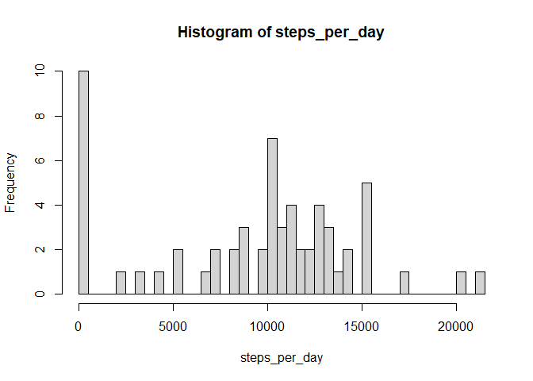
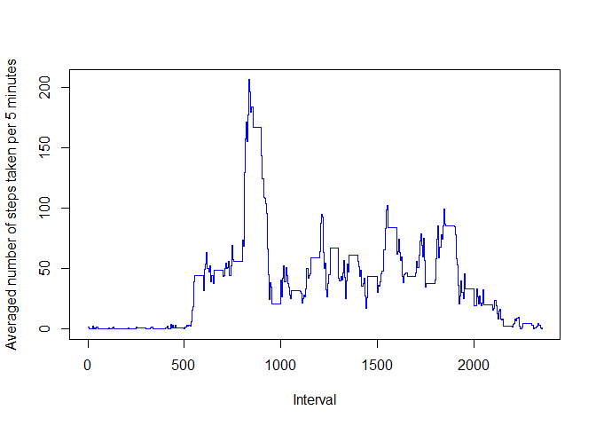
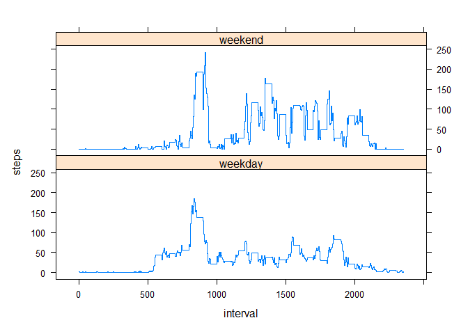

## Loading and preprocessing the data
Load the libraries:


```r
library(dplyr)
```

```
## 
## Attaching package: 'dplyr'
```

```
## The following objects are masked from 'package:stats':
## 
##     filter, lag
```

```
## The following objects are masked from 'package:base':
## 
##     intersect, setdiff, setequal, union
```

```r
library(lattice)
```

Download and unzip the data file:


```r
if (!file.exists("activity.csv")){
  if (!file.exists("activity.zip")){
    download.file(url="https://github.com/rlnds/RepData_PeerAssessment1/blob/master/activity.zip?raw=true", 
                  dest="activity.zip", mode="wb")}
  unzip("activity.zip", exdir = "./")
}
```

Load the data:


```r
data <- read.csv("activity.csv")
```

Create a function to convert the interval values into "hours:minutes":


```r
hhmm <- function(s){
  s<-as.character(s)
  if (nchar(s)==1){s<-paste("00:0",s,sep="")}
  else if (nchar(s)==2){s<-paste("00:",s,sep="")}
  else if (nchar(s)==3){s<-paste("0",substr(s,1,1),":",substr(s,2,3),sep="")}
  else {s<-paste(substr(s,1,2),":",substr(s,3,4),sep="")}
}
```

Add two columns: hm and datetime, containing hours:minutes and date and time, respectively:


```r
data <- mutate(data, hm=sapply(data$interval,function(x){hhmm(x)}),
               datetime=strptime(paste(date,hm), "%Y-%m-%d %H:%M"))
head(data,5)
```

```
##   steps       date interval    hm            datetime
## 1    NA 2012-10-01        0 00:00 2012-10-01 00:00:00
## 2    NA 2012-10-01        5 00:05 2012-10-01 00:05:00
## 3    NA 2012-10-01       10 00:10 2012-10-01 00:10:00
## 4    NA 2012-10-01       15 00:15 2012-10-01 00:15:00
## 5    NA 2012-10-01       20 00:20 2012-10-01 00:20:00
```

## What is mean total number of steps taken per day?

Calculate the total number of steps taken each day:


```r
steps_per_day <- sapply(split(data,data$date),
                        function(x){sum(x[,"steps"], na.rm=TRUE)})
```

Make a histogram of the total number of steps taken each day:


```r
hist(steps_per_day,length(steps_per_day))
```

<!-- -->

Mean total number of steps taken per day:


```r
mean_number_of_steps_per_day <- mean(steps_per_day)
mean_number_of_steps_per_day
```

```
## [1] 9354.23
```

Median total number of steps taken per day:


```r
median_number_of_steps_per_day <- median(steps_per_day)
median_number_of_steps_per_day
```

```
## [1] 10395
```

## What is the average daily activity pattern?

Make a time series plot of the 5-minute interval (x-axis) and the average number of steps taken, averaged across all days (y-axis):


```r
avr_steps <- summarize_at(group_by(data,interval), "steps", mean, na.rm=TRUE)
plot(avr_steps$interval, avr_steps$steps, type = "s", lwd = 1.5, col = "blue",
     xlab = "Interval", ylab = "Averaged number of steps taken per 5 minutes")
```

<!-- -->

Which 5-minute interval, on average across all the days in the dataset, contains the maximum number of steps?


```r
index <- which(avr_steps$steps==max(avr_steps$steps))
avr_steps$steps[index]
```

```
## [1] 206.1698
```

```r
avr_steps$interval[index]
```

```
## [1] 835
```


## Imputing missing values

Calculate and report the total number of missing values in the dataset (i.e. the total number of rows with NAs):


```r
colSums(is.na.data.frame(data))
```

```
##    steps     date interval       hm datetime 
##     2304        0        0        0        0
```

Create a new dataset that is equal to the original dataset but with the missing replaced by zeros:


```r
data2 <- data.frame(data)
data2$steps[is.na(data2$steps)]=0
```

Make a histogram of the total number of steps taken each day and calculate and report the mean and median total number of steps taken per day. Do these values differ from the estimates from the first part of the assignment? What is the impact of imputing missing data on the estimates of the total daily number of steps?

Calculate the total number of steps taken each day:


```r
steps_per_day2 <- sapply(split(data2,data2$date),
                        function(x){sum(x[,"steps"])})
```

Make a histogram of the total number of steps taken each day:


```r
hist(steps_per_day2,length(steps_per_day2))
```

<!-- -->

Calculate and report the mean and median total number of steps taken per day:


```r
mean_number_of_steps_per_day2 <- mean(steps_per_day2)
mean_number_of_steps_per_day2
```

```
## [1] 9354.23
```

```r
median_number_of_steps_per_day2 <- median(steps_per_day2)
median_number_of_steps_per_day2
```

```
## [1] 10395
```

Mean number of steps per day (NAs are present): 9354.

Mean number of steps per day (NAs have been replaced by zeros): 9354.

Median number of steps per day (NAs are present): 1.0395\times 10^{4}.

Median number of steps per day (NAs have been replaced by zeros): 1.0395\times 10^{4}.

Mean and median values in both cases are the same because the total number of steps per day from the original data set were calculated by setting na.rm=TRUE.


## Are there differences in activity patterns between weekdays and weekends?

Create a new factor variable (daytype) in the dataset with two levels: "weekday" and "weekend", indicating whether a given date is a weekday or weekend day:


```r
data2 <- mutate(data2, daytype=sapply(data2$datetime, function(x){
  y<-"weekday"
  if (x$wday>5){y<-"weekend"}
  y
  }))
```

Make a panel plot containing a time series plot (i.e. type = "l") of the 5-minute interval (x-axis) and the average number of steps taken, averaged across all weekday days or weekend days (y-axis):


```r
xyplot(steps ~ interval | daytype, 
       data = summarize_at(group_by(data2,daytype,interval),"steps",mean),
       type = "s",
       lwd = 1.5,
       layout = c(1, 2))
```

<!-- -->
